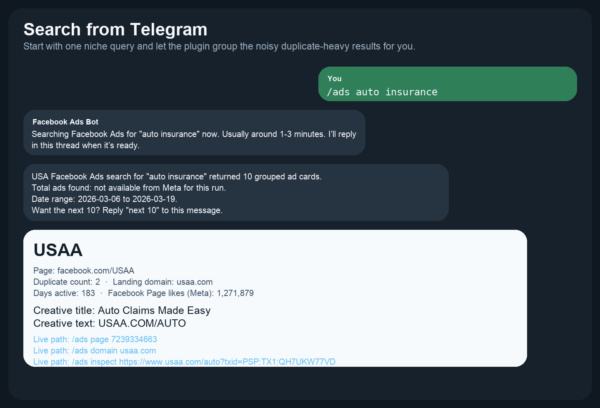
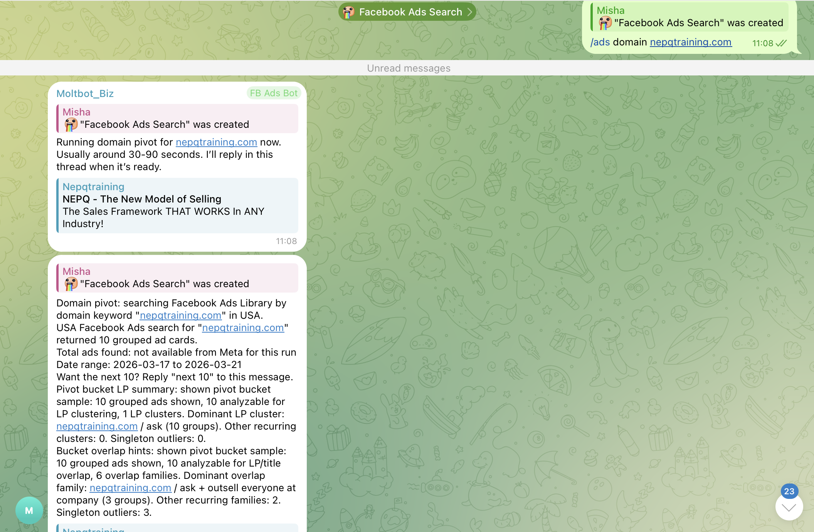
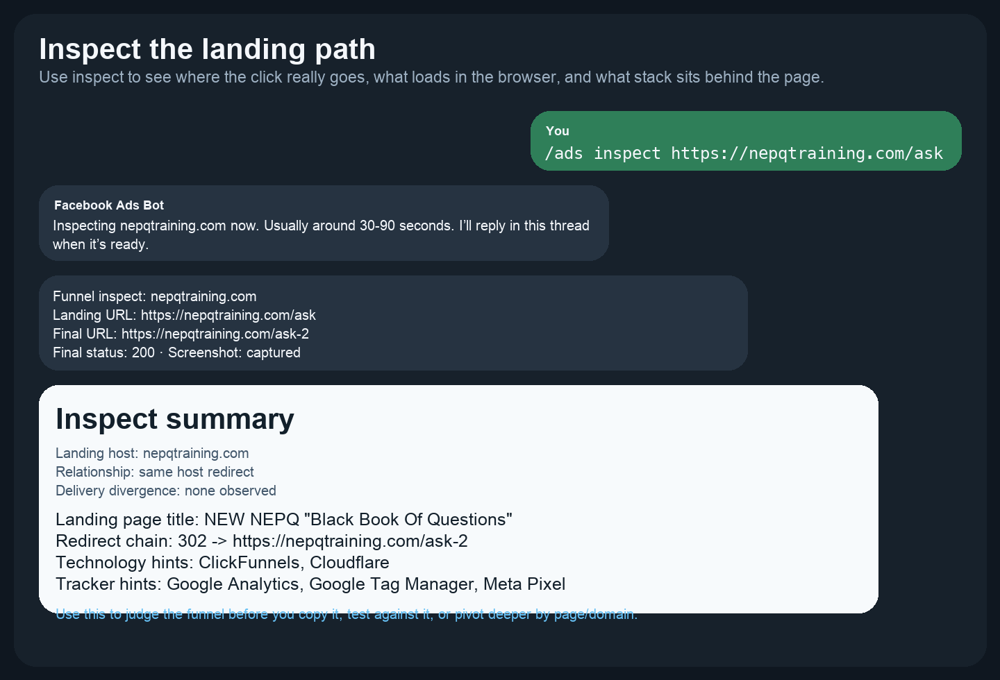

# JOIN OUR COMMUNITY ON [SKOOL](https://www.skool.com/ai-agents-openclaw)

Need OpenClaw first? Start with the [OpenClaw setup guide in Skool Classroom](https://www.skool.com/ai-agents-openclaw/classroom). If you need live help while wiring Telegram or your runtime, use the [Skool community](https://www.skool.com/ai-agents-openclaw).

# OpenClaw Facebook Ads Spy

Build your own Facebook ad research stack inside OpenClaw instead of renting a rigid spy tool that costs hundreds of dollars every month.

This plugin lets you search the US Facebook Ads Library from Telegram, pivot into the exact page or domain behind an ad, inspect the landing path, and surface the metadata that matters when you are trying to find live funnels fast.

It fits into OpenClaw as a plugin, not as a separate bot.

## What You Get

- **Your own customizable alternative to expensive ad-spy SaaS.** Keep the workflow in your OpenClaw stack and shape it around your own niche, routing, and operator habits.
- **Fast discovery of live advertisers and offers.** See active pages, grouped duplicates, creative text, landing domains, and ad-library links without leaving Telegram.
- **Real funnel tracing instead of keyword-only search.** Follow the path from the landing URL to the final URL, browser-observed result, redirect chain, trackers, and screenshot evidence.
- **A workflow that adapts to you.** Pivot by page, domain, inspect, and next-page follow-up in one thread instead of bouncing between tools.
- **A cheap shell around deterministic acquisition.** The surrounding OpenClaw runtime is tested on `openrouter/google/gemini-3.1-flash-lite-preview`, while the ad acquisition and inspect logic stays deterministic instead of guessing.

## What You Can Uncover

- **Who is really buying traffic** in a niche
- **Which page and domain** they use repeatedly
- **Which creatives and hooks** keep showing up
- **Which landing pages and redirects** traffic flows through
- **Which trackers and tech stack** sit behind the funnel
- **Which ad variants are the main machine** versus one-off outliers

## How You Use It

Start simple:

```text
/ads auto insurance
/ads domain example.com
/ads page 123456789
/ads inspect https://example.com
```

Then keep digging inside the same thread:

```text
Reply "domain"
Reply "page"
Reply "inspect"
Reply "next 10"
```

### 1. Search a niche



### 2. Pivot into the page or domain that looks like a real machine



### 3. Run inspect on the exact landing URL you want to verify



## Install It Into Your Existing OpenClaw

### Step 1. Get OpenClaw running

If OpenClaw is not running yet, use the [OpenClaw setup guide in Skool Classroom](https://www.skool.com/ai-agents-openclaw/classroom).

This repository does **not** teach full OpenClaw deployment from zero. It only covers adding this plugin to an existing OpenClaw runtime.

### Step 2. Prepare Telegram for this plugin

Follow [docs/TELEGRAM_SETUP.md](docs/TELEGRAM_SETUP.md).

You will collect the two values the plugin needs:

- **`telegramChatId`**
- **`telegramThreadId`**

If you get stuck while wiring Telegram, ask in the [Skool community](https://www.skool.com/ai-agents-openclaw).

### Step 3. Wire OpenRouter

Follow [docs/OPENROUTER_SETUP.md](docs/OPENROUTER_SETUP.md).

Recommended primary model:

- **`openrouter/google/gemini-3.1-flash-lite-preview`**

### Step 4. Install Playwright if you want inspect screenshots

Clone the plugin repo first:

```bash
git clone https://github.com/no-name-labs/openclaw-facebook-ads-spy.git
cd openclaw-facebook-ads-spy
```

If you want screenshot-backed `/ads inspect ...`, run:

```bash
./scripts/install-inspect-deps.sh
```

On Debian/Ubuntu hosts, if that script says `python3-venv` is missing, install it once:

```bash
sudo apt-get install -y python3-venv
```

If Ubuntu still reports that `ensurepip` is unavailable, install the versioned
venv package too:

```bash
sudo apt-get install -y python3.12-venv
```

The script creates a repo-local `.venv` and the plugin auto-detects it.

If you do not need inspect screenshots yet, you can skip this step and come back later.

### Step 5. Install and enable the plugin

```bash
openclaw plugins install "$(pwd)"
openclaw plugins enable facebook-ads-us
```

### Step 6. Merge the config snippet and restart OpenClaw

Copy the plugin block from [examples/openclaw-plugin-config.json](examples/openclaw-plugin-config.json) into your `openclaw.json`.

Then restart OpenClaw so the Telegram route and plugin config are live together.

### Step 7. Run the first command

Send:

```text
/ads auto insurance
```

in your dedicated Telegram ads topic.

## Optional Reliability Upgrade

If your Meta acquisition is unstable, you can route **Meta-facing requests only** through a residential HTTP/HTTPS proxy.

Read [docs/META_PROXY_SETUP.md](docs/META_PROXY_SETUP.md).

Telegram transport and OpenRouter stay direct.

## Why It Stays Cheap

This plugin is tested inside OpenClaw with `openrouter/google/gemini-3.1-flash-lite-preview`.

That gives you a fast, low-cost shell around the plugin, while the Facebook Ads acquisition and inspect path stays deterministic instead of LLM-generated guesswork.

## Scope

This repository is the installable distribution package for the plugin.

The private development source of truth stays separate. OpenClaw deployment tutorials, host bootstrap walkthroughs, and advanced operator support live in the [Skool community](https://www.skool.com/ai-agents-openclaw).
